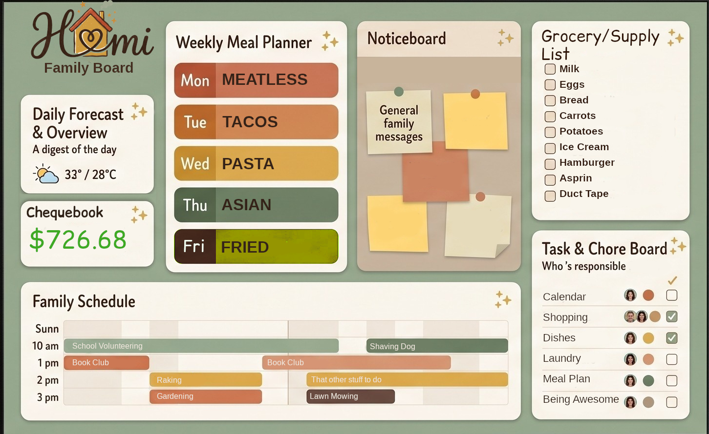
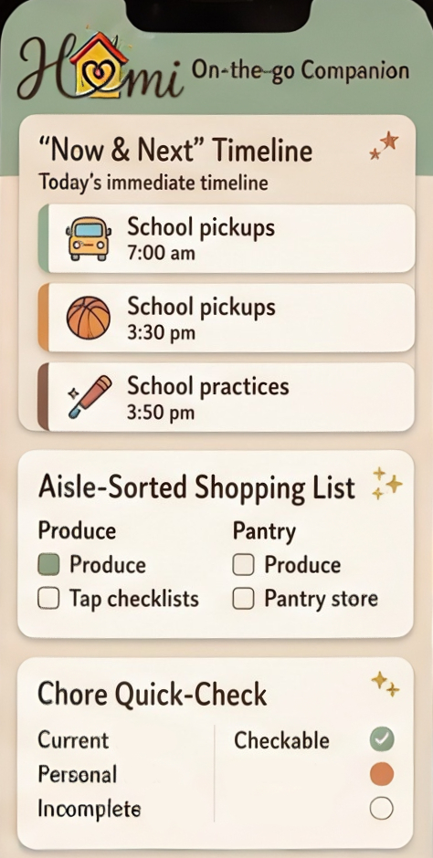

# Homi

Homi is a self-hosted, server-authoritative household platform. Core provides identity, households, permissions, offline synchronization, a responsive shell, and a public module SDK. Household features are independently packaged modules that install through the managed lifecycle instead of being compiled into Core.

> Project status: first public pre-1.0 release. Core, Calendar, and Chequebook pass clean-machine installation and release validation. Homi is self-hosted; publishing this source code never publishes or grants access to any private Homi installation.

### Family Board direction



*Design-direction reference for Homi's household dashboard and future large-screen Family Board. It is not a screenshot of the current web application.*

### Phone companion direction



*Design-direction reference for Homi's on-the-go phone companion. It is not a screenshot of the current web application.*

## Actual application screens

| Phone Dashboard | Desktop Dashboard |
| --- | --- |
|  |  |

| Chequebook | Calendar |
| --- | --- |
|  |  |

Additional release details and known limitations are in [the release notes](docs/RELEASE_NOTES.md).

## What works now

- Better Auth accounts and household membership/permissions
- PostgreSQL-backed authoritative data with audited change/outbox records
- installable mobile-first PWA with account-and-household isolated offline sync
- Core-owned Dashboard, Modules, Settings, Search, and Add surfaces
- independent module packages, immutable version/digest registry, transactional migrations, rollback, enable/disable, setup, assets, jobs, sync adapters, settings, and Family Board contributions
- public `@homi/module-sdk`, `@homi/ui`, and starter module template
- Calendar `0.6.9` and Chequebook `0.1.12`
- gated cross-module broker communication with install/enable guidance when a provider is unavailable
- editable household Chequebook categories and bidirectional recurring Calendar/Chequebook entries
- fail-closed Ed25519-signed GitHub module-directory verification
## Architecture

Core owns platform policy and shared controls. Modules declare navigation, contextual Search/Add actions, setup/settings, permissions, sync entities, jobs, Home cards, and broker capabilities through public contracts. A module must not import private Core/Web code or another module.

Installation and household use are separate:

1. an operator installs a validated immutable artifact;
2. a household administrator enables it for the household;
3. each family member chooses which module cards appear on their own Dashboard.

A failed module migration rolls back its candidate schema/data and registry promotion in one PostgreSQL transaction. The prior applied artifact/version stays active. Full database backups remain the disaster-recovery layer.

## Requirements

- Docker with Compose v2
- Node.js 24
- pnpm 12
- PostgreSQL is supplied by Compose for the standard deployment

## Local build and validation

```bash
corepack enable
pnpm install --frozen-lockfile
pnpm build
pnpm typecheck
pnpm --filter @homi/core module-directory:validate
```

Copy `.env.example` to `.env`, replace every secret placeholder independently, set the public HTTPS origin, and configure the signed module directory when one is available. A GitHub token is needed only when the directory or module release assets are private. The default Web/Core host ports are `3100`/`3101` on loopback; `HOMI_WEB_PORT`, `HOMI_CORE_PORT`, and `HOMI_BIND_ADDRESS` may be changed when running separate Compose projects on one host.

## First deployment

```bash
docker compose build
docker compose up -d db
docker compose --profile maintenance run --rm migrate
read -rsp "Initial Homi password: " HOMI_BOOTSTRAP_PASSWORD && echo
export HOMI_BOOTSTRAP_PASSWORD
docker compose --profile maintenance run --rm \
  -e HOMI_BOOTSTRAP_EMAIL=owner@example.com \
  -e HOMI_BOOTSTRAP_PASSWORD \
  -e HOMI_BOOTSTRAP_NAME="Household Owner" \
  -e HOMI_BOOTSTRAP_HOUSEHOLD="Our Home" \
  -e HOMI_BOOTSTRAP_LOCALE=en-CA \
  -e HOMI_BOOTSTRAP_TIME_ZONE=America/Toronto \
  bootstrap
unset HOMI_BOOTSTRAP_PASSWORD
docker compose --profile maintenance run --rm module-admin install /app/packages/calendar
docker compose --profile maintenance run --rm module-admin install /app/packages/chequebook
docker compose up -d module-manager core web
```

Replace the bootstrap identity, locale, and IANA time zone with the household's real values. The bootstrap command works only while Homi has no account and creates the first user, household, linked household person, and Household Administrator role together. A second attempt fails closed rather than creating another owner.

The two module installs are deliberately separate from the Core image lifecycle. Enable installed modules per household from Homi's Modules screen.

### Deployment provenance

Never build production from a hand-updated or partially synchronized server tree. From a clean, pushed checkout, run `scripts/package-deployment.sh`. It creates a tracked-files-only archive containing `.homi-source-commit`. After extracting that archive into a fresh staging directory, run `scripts/verify-deployment-source.sh <full-commit-sha>` before any image build. The verifier fails closed when the marker, required web-proxy files, or expected commit is missing or mismatched.

Keep the live `.env`, PostgreSQL volume, managed-module volume, and backups outside the extracted source directory. Promote only images built from the verified staging directory, and retain the previous image IDs until post-deployment module loading and health checks pass.

Do not expose PostgreSQL publicly. Put the web and Core services behind HTTPS and set `HOMI_AUTH_BASE_URL` to the public origin.

## Module development

Start from [the module template](templates/homi-module-template/README.md). The authoritative contracts and operations are:

- [Module authoring](docs/MODULE_AUTHORING.md)
- [Module installer operations](docs/MODULE_INSTALLER_OPERATIONS.md)
- [Backup and disaster recovery](docs/BACKUP_RECOVERY.md)
- [Trusted module directory](docs/MODULE_DIRECTORY.md)
- [Design system requirements](docs/DESIGN_SYSTEM_REQUIREMENTS.md)
- [Roadmap](docs/ROADMAP.md)

The installer never runs package-manager or arbitrary lifecycle scripts. It validates package paths/imports, manifest/API compatibility, schema ownership, migration SQL, publisher ownership, semantic-version direction, and SHA-256 immutability before promotion.

## Repository layout

- `apps/core` — Fastify Core API, module host, installer, broker, and jobs
- `apps/web` — React/Vite PWA and generic web-module host
- `packages/db` — Core PostgreSQL schema and migrations
- `packages/module-sdk` — public module contract
- `packages/ui` — shared Homi design system
- `packages/calendar` — first-party Calendar module
- `packages/chequebook` — first-party Chequebook module
- `templates/homi-module-template` — independent starter module

## Security and release status

Real secrets and signing private keys must never be committed. Module-directory trust keys are configured locally; catalogue entries point only to immutable GitHub release assets and pin their SHA-256 digest.

Homi is public as a pre-1.0 release. Public source, documentation, and signed module packages do not expose or publish operators' private servers, domains, credentials, data, or deployment configuration. Validation evidence is tracked in [the release checklist](docs/RELEASE_CHECKLIST.md) and [roadmap](docs/ROADMAP.md).

## Licence

Homi is licensed under the [GNU Affero General Public License v3.0](LICENSE). Modified network-hosted versions must make their corresponding source available as required by the licence.
