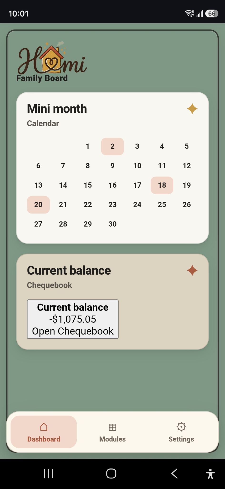
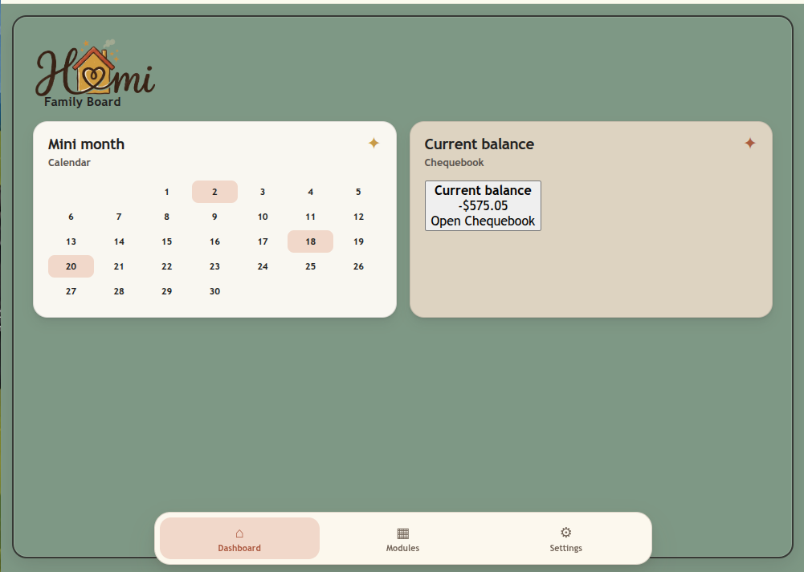
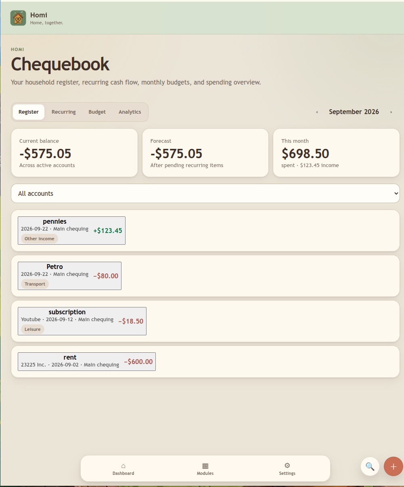
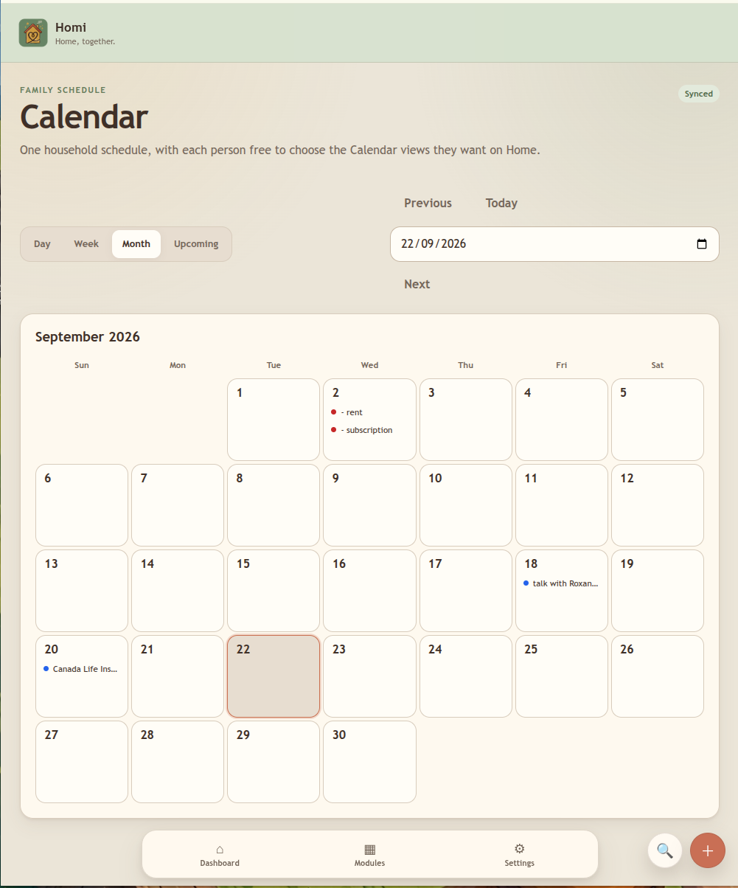

# Homi first public pre-1.0 release

Status: first public pre-1.0 release.

## Included

- Homi Core with accounts, households, permissions, audited changes, offline-first synchronization, PWA delivery, backup/recovery, and the managed module platform.
- Calendar 0.6.9.
- Chequebook 0.1.12.
- Public `@homi/module-sdk`, `@homi/ui`, and the starter module template.
- Signed module-directory verification and administrator-only install, update, disable, uninstall, reinstall, and rollback.
- Per-household module enablement and per-member Dashboard visibility/order.
- Calendar ↔ Chequebook recurring-entry integration through the public broker contract.

## Installation and upgrade

New installations follow [First deployment](../README.md#first-deployment). Operators must set independent secrets, a public HTTPS origin, and trusted module-directory keys before enabling directory installation.

Before any upgrade, create and verify the database and managed-module backups described in [Backup and disaster recovery](BACKUP_RECOVERY.md). Update source, rebuild the images, run Core migrations, then install module updates through Homi's managed installer. Do not replace the managed-module volume manually.

Recovery from a failed module update follows [Module installer operations](MODULE_INSTALLER_OPERATIONS.md#recover-a-failed-update). Whole-installation restoration follows [Backup and disaster recovery](BACKUP_RECOVERY.md#restore).

## Known limitations

- Homi is pre-1.0. Public module APIs are versioned, but breaking changes may still occur before 1.0 and will be documented.
- Calendar supports Homi calendars and a restricted Apple CalDAV provider. It is not a general-purpose arbitrary CalDAV proxy.
- The first public catalogue contains the first-party Calendar and Chequebook packages. The reusable starter template remains in source; no demo module is published.
- TLS termination, certificates, DNS, HSTS, host firewalling, and off-host backup retention remain operator responsibilities.
- Module installation and lifecycle changes require a household administrator; ordinary members control only their own Dashboard visibility and card order.

## Validation status

The release passed clean installation, first-account bootstrap, dependency and security review, authenticated accessibility, multi-device synchronization, offline reconnect, PWA update, backup restoration, full module lifecycle and rollback, and CI. Exact evidence is recorded in [the public-release checklist](RELEASE_CHECKLIST.md). Private operator domains and deployment configuration are not part of the public release.

## Actual application screens

